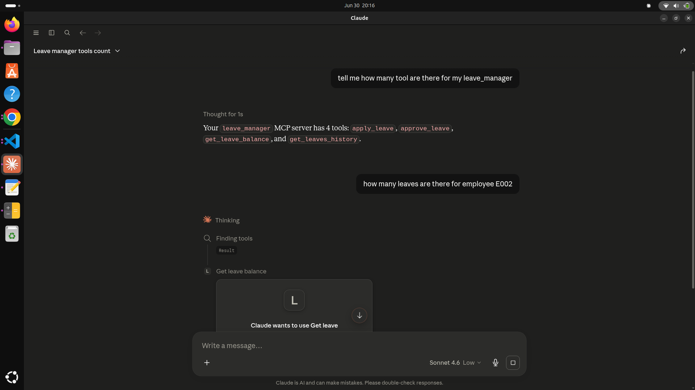
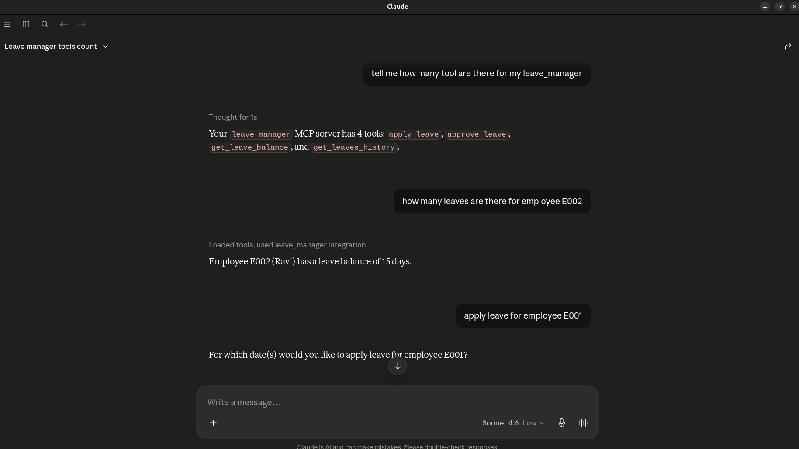
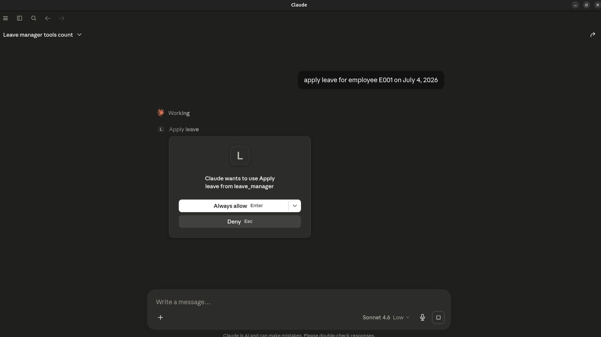
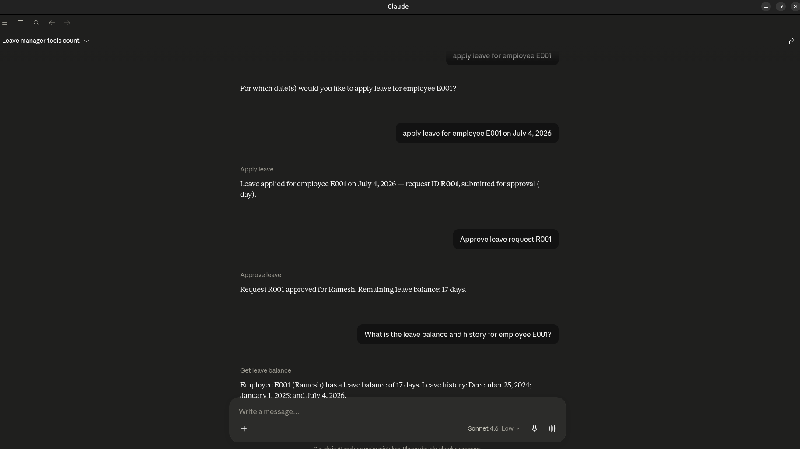
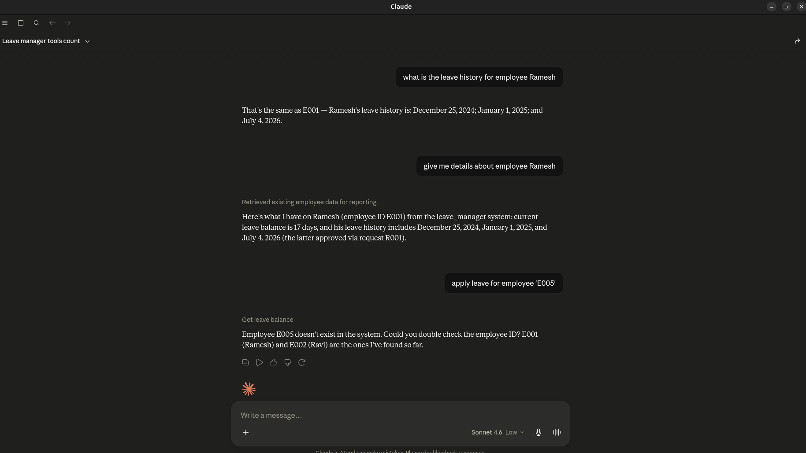

## Scope of Work - MCP (Model Context Protocol) Server

### Project Overview

`leave_manager` is a Model Context Protocol (MCP) server that exposes a complete employee leave management workflow as a set of callable tools, enabling natural-language interaction with an HR system through any MCP-compatible client (demonstrated here with Claude Desktop). The project demonstrates hands-on agentic tool-use architecture, going beyond simple request/response patterns to implement a stateful, multi-step approval workflow.

### Objectives

- Design and implement an MCP server using the official Python MCP SDK (`FastMCP`) to expose backend business logic as LLM-callable tools.
- Model a realistic two-step HR workflow (request → approval) rather than a single-step CRUD operation, requiring in-memory state management across tool calls.
- Integrate the server with Claude Desktop via `claude_desktop_config.json`, using `uv` for environment and dependency management.
- Validate end-to-end tool invocation through natural language prompts, confirming correct parameter extraction, state mutation, and error handling.

### Core Features / Tools Implemented

- **`get_leave_balance(employee_id)`** — Retrieves an employee's current leave balance and leave history; handles invalid employee IDs gracefully.
- **`apply_leave(employee_id, leave_dates)`** — Submits a leave request for one or more dates; validates against available balance and creates a pending request rather than auto-approving, enabling a manager-review step.
- **`get_pending_requests()`** — Lists all outstanding leave requests awaiting manager approval, supporting the manager-facing side of the workflow.
- **`approve_leave(request_id)`** — Approves a pending request by ID, deducting the leave balance and updating history only at the point of approval (not at submission), modeling a real-world authorization gate.
- **`get_leaves_history(employee_id)`** — Returns an employee's full leave history.

### Technical Implementation

- **Protocol & SDK**: Built using the Model Context Protocol (MCP) Python SDK (`mcp[fastmcp]`), exposing typed, schema-validated tools (input/output schemas auto-generated from Python type hints).
- **State Management**: In-memory data store with a request-ID-based pending-requests queue, separating "submission" state from "approved" state to mirror real HR approval flows.
- **Environment Management**: Project dependencies and execution managed via `uv` (`pyproject.toml`-based), with the server launched through `uv run` for reproducible environment isolation.
- **Client Integration**: Configured as a local stdio-based MCP server in Claude Desktop (`claude_desktop_config.json`), verified via Claude Desktop's MCP developer logs (`tools/list`, `initialize`, and live tool-call traces).
- **Error Handling**: Defensive checks for invalid employee IDs, insufficient leave balance, duplicate/invalid request IDs, and already-processed requests.

### Skills Demonstrated

- Agentic AI / Tool-Calling architecture (MCP protocol, tool schema design)
- Python backend development (state machines, data validation, error handling)
- AI client integration and debugging (Claude Desktop config, MCP server logs, `uv`-based environment isolation)
- API/tool design principles applicable to production agentic systems (idempotency, separation of request vs. approval state)

### Future Enhancements (Optional Roadmap)

- Persist data to a real database (SQLite/MongoDB) instead of in-memory storage.
- Add role-based access control (employee vs. manager permissions per tool).
- Add a `reject_leave` tool and notification/audit logging for approvals and rejections.
- Expose as a remote MCP server (HTTP/SSE transport) for multi-user access beyond local Claude Desktop.
